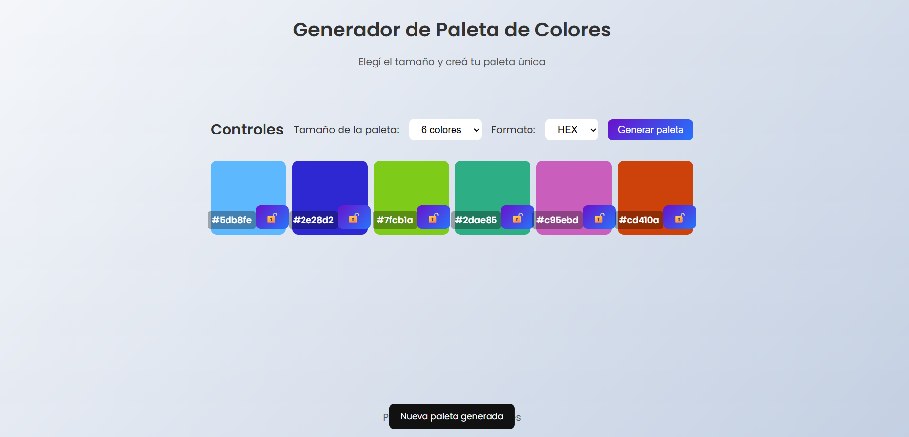
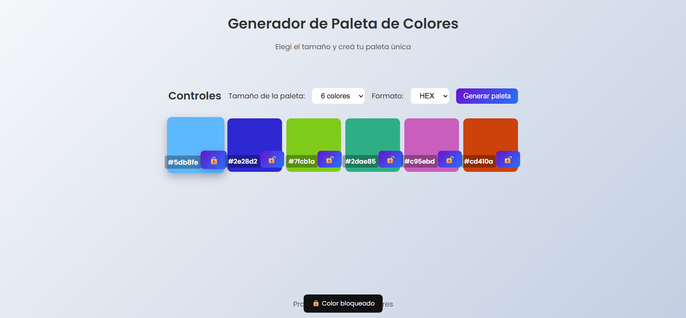
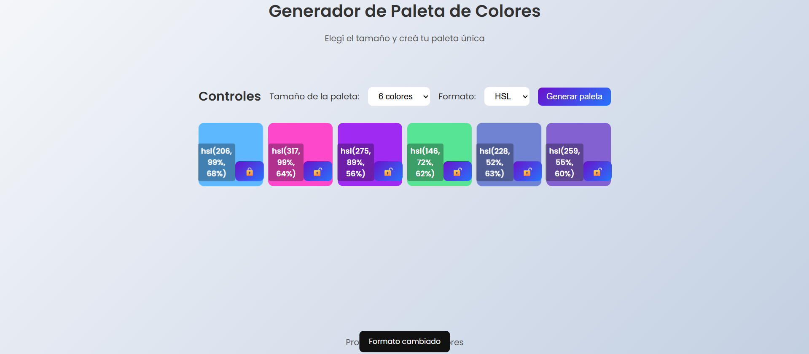

# Color Palette Generator 🎨

Aplicación web interactiva para generar paletas de colores de forma aleatoria. Permite elegir el tamaño de la paleta, el formato del código de color, bloquear colores individuales y copiarlos al portapapeles con un click.

---

## Demo

> Abrí `index.html` en tu navegador o desplegá en GitHub Pages.

---

## Funcionalidades

- Generación aleatoria de paletas de colores
- Selección de tamaño: 6, 8 o 9 colores
- Soporte para formatos **HEX** y **HSL**
- Bloqueo individual de colores para conservarlos al regenerar
- Copiado automático al portapapeles al hacer click en un color
- Feedback visual con tooltips animados
- Interfaz responsive — mobile first
- Accesibilidad con `aria-label`, `aria-live` y navegación por teclado

---

## Tecnologías

| Tecnología | Uso |
|---|---|
| HTML5 semántico | Estructura de la aplicación |
| CSS3 | Estilos, animaciones y responsive design |
| JavaScript ES6 | Lógica, manipulación del DOM y generación de colores |

Sin frameworks ni librerías externas.

---

## Cómo correr el proyecto

```bash

git clone: https://github.com/JoaquinG-eng/Color-Palette-Generator.git


```

No requiere instalación ni servidor.

---

## Estructura del proyecto

```
/
├── index.html
├── CSS/
│   └── style.css
├── JS/
│   └── script.js
├── ASSETS/
│   └── capturas/
│       ├── screen1.png
│       ├── screen2.png
│       ├── screen3.png
│       └── screen4.png
└── README.md
```

---

## Capturas de pantalla

### Vista principal


### Colores bloqueados


### Formato HSL


### Vista mobile


---

## Aspectos técnicos destacados

### Generación armónica de colores con HSL

Los colores se generan en el modelo HSL para garantizar combinaciones visualmente equilibradas. La saturación y luminosidad están acotadas a rangos que evitan colores demasiado apagados o demasiado brillantes:

```javascript
const h = Math.floor(Math.random() * 360);      
const s = Math.floor(Math.random() * 50) + 50;  
const l = Math.floor(Math.random() * 30) + 40;  
```

### Conversión HSL → HEX

La conversión se hace matemáticamente sin librerías. El proceso normaliza los valores, calcula los componentes RGB intermedios y los convierte a hexadecimal:

```
hsl(210, 80%, 60%) → #4da6ff
```

### Sistema de bloqueo de colores

Al regenerar la paleta, los colores bloqueados se conservan en su posición. Se guardan en un array antes de limpiar el DOM y se reutilizan al construir la nueva paleta.

### Accesibilidad

- HTML semántico con `<header>`, `<main>`, `<section>`, `<footer>`
- `aria-label` en controles y contenedor de paleta
- `aria-live="polite"` en la sección de paleta para lectores de pantalla
- `aria-label` dinámico en botones de bloqueo (cambia entre "Bloquear" y "Desbloquear")
- Navegación por teclado con `Enter` y `Space` en botones de bloqueo
- Estados `focus` visibles

---

## Deploy en GitHub Pages

1. Ir al repositorio en GitHub
2. Entrar en **Settings → Pages**
3. En **Source** elegir:
   - Branch: `main`
   - Folder: `/root`
4. Guardar — GitHub Pages genera el link automáticamente

---

## Autor

**Joaquín González**