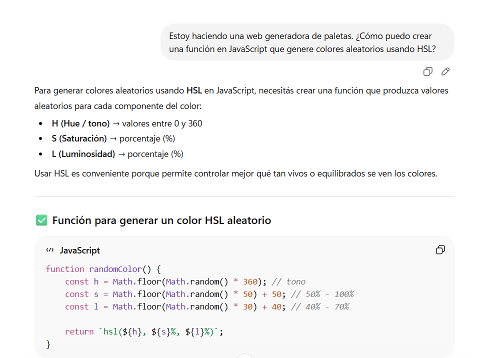

# Generador de Paletas de Colores

Aplicación web que genera colores aleatorios usando HSL.

## Funcionalidades

- Generación de colores
- Uso de JavaScript
- Manipulación del DOM

## Capturas

## Uso de IA

Este proyecto utilizó IA para:
- Generar código
- Detectar errores
- Proponer soluciones

### comienzo de la documentacion!

En esta pantalla se muestra la función `randomColor`.
     La IA fue utilizada para:
- Generar la lógica de colores en HSL
- Explicar cómo funcionan los valores

Se detecta un error en la conversión de color.

La IA identificó que faltaba sumar el valor `m`, lo que generaba colores incorrectos.

El botón no generaba la paleta.

La IA detectó que no se estaban creando elementos en el DOM.

Se implementa la solución.

La IA sugirió usar `createElement` y `appendChild` para renderizar los colores.

Vista final del proyecto funcionando.

Resultado final luego de aplicar las mejoras sugeridas por IA.